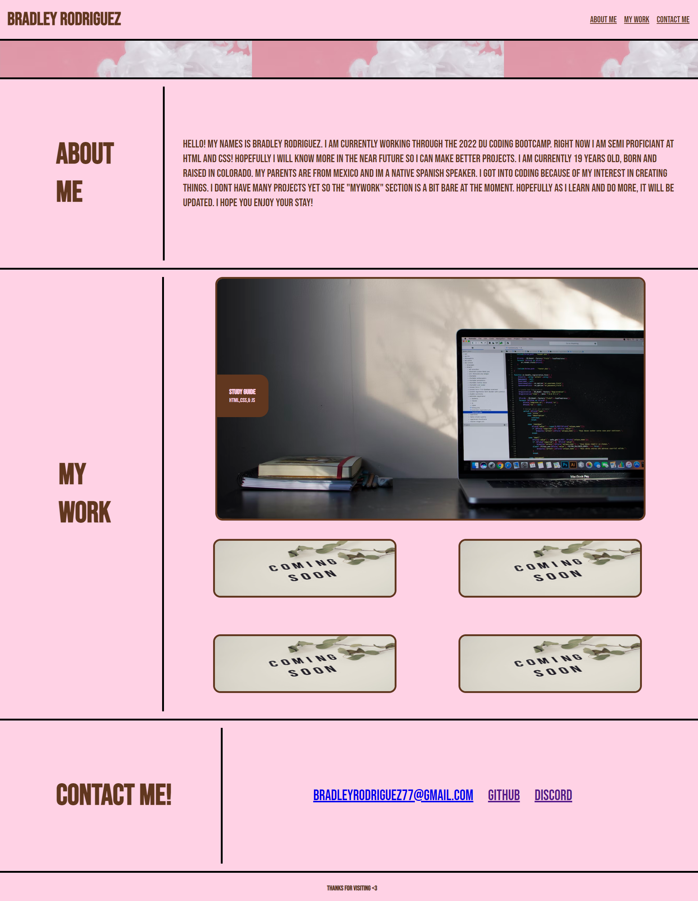

# My Portfolio

## Description

Inside this repo you will find my portfolio. This was created to that potential employers have an easy way to look at the work that I am capable of. It contains information about me, some work ive done, and ways to contact me.

## Installation

You can access the project by clicking on the github pages link that will take you to the live deployed site.

## Usage

To use this website you can navigate to your section of choice by using the navbar in the top right corner. Click on the main image to take you to a live site of my biggest project. The smaller images will link you to my github as they are unfilled spots at the moment. Click on any of the links in the contact me section for ways to get in touch with me.

## Credits

https://unsplash.com/images/stock/royalty-free

I pulled the images for this project from Unsplash.com
